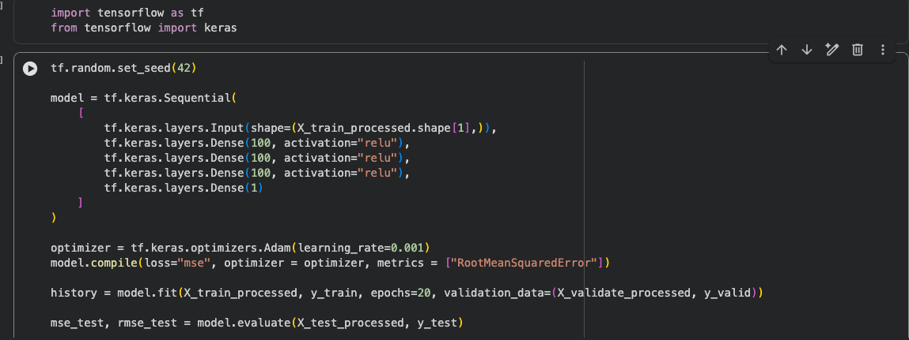
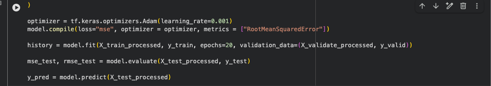
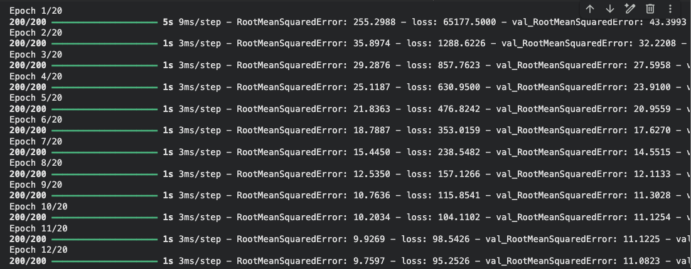
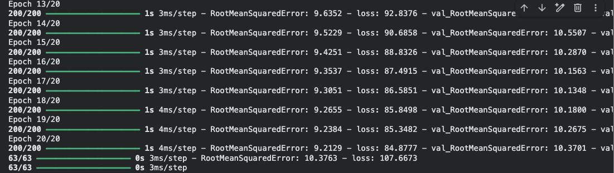
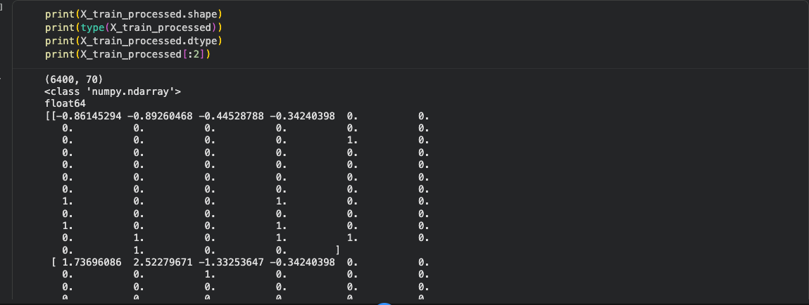

# Cab Fare Prediction using Neural Networks

A deep learning project that predicts taxi fares using a feed-forward neural network built with TensorFlow and Keras. The project demonstrates a complete machine learning workflow, including data preprocessing, feature engineering, neural network training, validation, and performance evaluation.

The primary goal of this project was to understand how neural networks can be applied to tabular regression problems while building an end-to-end machine learning pipeline.

---

## Project Overview

This project covers the complete pipeline required for training a neural network on structured data.

The workflow includes:

- Data preprocessing
- Missing value handling
- Feature scaling
- Categorical feature encoding
- Building a TensorFlow neural network
- Model training
- Validation
- Model evaluation on unseen test data
- Prediction generation

---

## Project Structure

```
Cab_Fare_Neural_Network
│
├── Images
│   ├── DataPreprocessing Pipeline.png
│   ├── Neural_Network_pipeline.png
│   ├── Neural_Network_pipeline_2.png
│   ├── Results_Epoch_1-12.png
│   ├── Results_Epochs_13-20.png
│   └── Train_Data_Overview.png
│
├── Notebook
│   └── Cab_Fare_Neural_Network.ipynb
│
├── Requirements.txt
└── Readme.md
```

---

## Data Preprocessing

The preprocessing pipeline was built using Scikit-learn's `Pipeline` and `ColumnTransformer`.

### Numerical Features

- Missing values filled using the median
- Features standardized using `StandardScaler`

### Categorical Features

- Missing values filled using the most frequent value
- One-hot encoding applied
- Unknown categories ignored during inference

The preprocessing pipeline ensures that both training and unseen data are transformed consistently.

### Pipeline


---

## Model Architecture

The neural network was implemented using TensorFlow/Keras.

Architecture:

- Input Layer
- Dense Layer (100 neurons, ReLU)
- Dense Layer (100 neurons, ReLU)
- Dense Layer (100 neurons, ReLU)
- Output Layer (1 neuron)

Optimizer:

- Adam
- Learning Rate = 0.001

Loss Function:

- Mean Squared Error (MSE)

Evaluation Metric:

- Root Mean Squared Error (RMSE)

---

## Neural Network

### Architecture



### Training Flow



---

## Training

The model was trained for **20 epochs** while monitoring validation performance.

```python
history = model.fit(
    X_train_processed,
    y_train,
    epochs=20,
    validation_data=(X_validate_processed, y_valid)
)
```

---

## Results

### Epochs 1–12



### Epochs 13–20



---

## Dataset Overview



---

## Technologies Used

- Python
- TensorFlow
- Keras
- NumPy
- Pandas
- Scikit-learn
- Matplotlib

---

## How to Run

### Clone the repository

```bash
git clone <repository-url>
```

### Navigate into the project

```bash
cd Cab_Fare_Neural_Network
```

### Install dependencies

```bash
pip install -r Requirements.txt
```

### Open the notebook

```bash
jupyter notebook
```

Run all cells inside:

```
Notebook/Cab_Fare_Neural_Network.ipynb
```

---

## What I Learned

Through this project I gained hands-on experience with:

- Building preprocessing pipelines using Scikit-learn
- Handling missing values
- Feature scaling and one-hot encoding
- TensorFlow Sequential API
- Designing regression neural networks
- Model training and validation
- Understanding loss functions and evaluation metrics
- Making predictions using trained neural networks

---

## Future Improvements

This project is part of my learning journey in deep learning.

In my recent learning sessions, I have explored more advanced TensorFlow concepts such as:

- Hyperparameter tuning with Keras Tuner
- Dynamic model architectures
- Learning rate scheduling
- Custom training workflows
- Advanced preprocessing pipelines
- Wide & Deep neural networks
- Subclassing TensorFlow models

In future versions of this project, I plan to incorporate these concepts to build a more robust and dynamic fare prediction model. This includes automatically tuning hyperparameters, experimenting with different network architectures, improving feature engineering, and comparing multiple models to achieve better performance.

---

## Repository Purpose

This repository is one of several projects I am building while learning Neural Networks and Deep Learning. The focus is not only on obtaining good prediction accuracy but also on understanding each component of the machine learning pipeline and documenting the complete development process.

---

## Author

**Bhavan Prakash**

Computer Science Student | Deep Learning & AI Enthusiast

Currently learning:

- Neural Networks
- Deep Learning
- Computer Vision
- TensorFlow
- Machine Learning